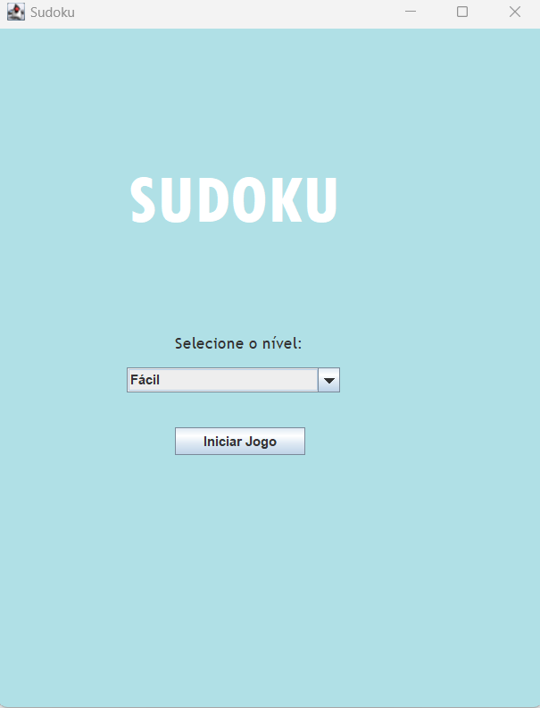
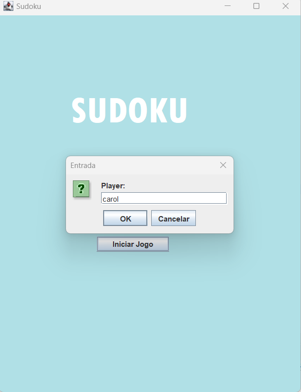
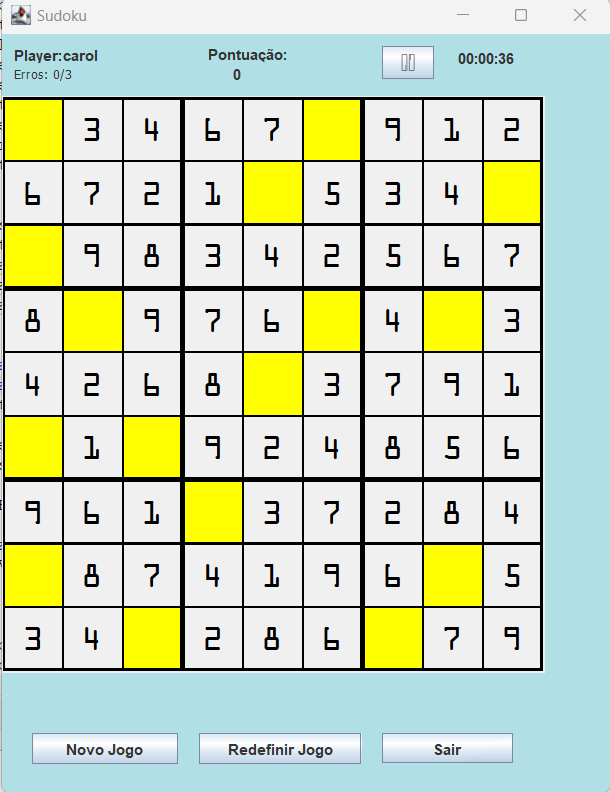
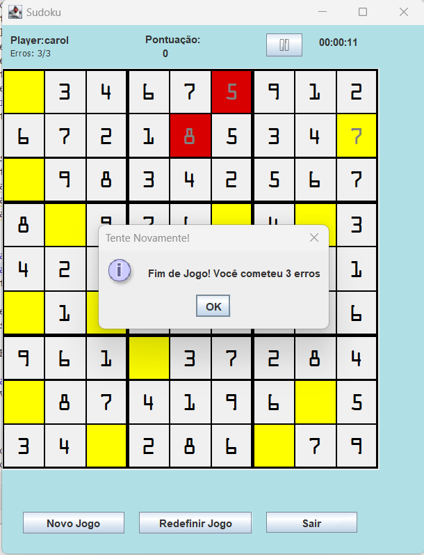
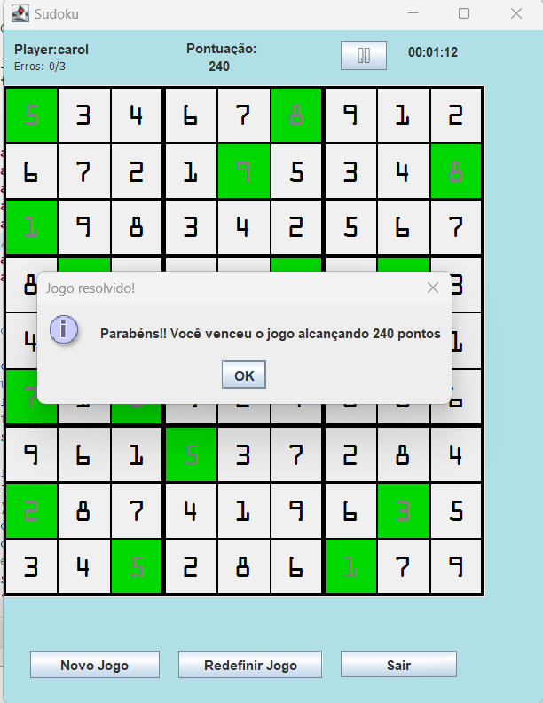

# Sudoku
Repositório dedicado ao trabalho final da disciplina de Programação Orientada a Objetos, lecionada pelo professor Manoel Neto no Instituto Federal da Bahia.

O código base desse projeto pode ser encontrado aqui: https://www3.ntu.edu.sg/home/ehchua/programming/java/JavaGame_Sudoku.html

- Desenvolvedoras:
- Alda Monique
- Caroline Lima 
# Descrição do Jogo
A ideia do jogo é bastante simples: preencher uma grade de 9 quadrados na horizontal por 9 quadrados na vertical de modo que, em cada linha, em cada coluna e em cada quadrado maior, haja números de 1 a 9 sem repetir nenhum deles.

# Telas 

